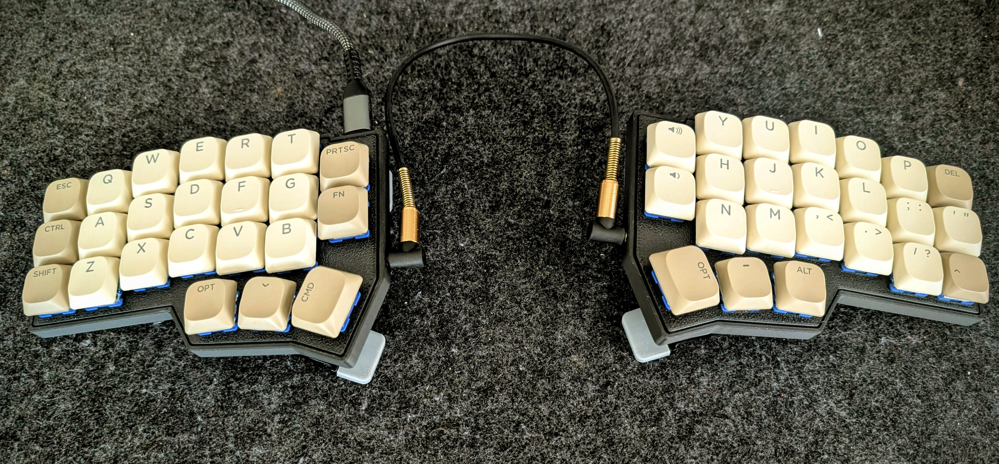

# Corne Restricted Environment Config

Security-hardened QMK firmware for the Corne v4.1 (crkbd rev4_1 standard). Designed for high-security environments where dynamic memory access (VIA/Vial) and unidentified USB devices are prohibited by IT security policies.




## Key Features

Unlike standard firmwares, this setup is a **Static Source of Truth**:

- **No Dynamic Storage**: VIA, Vial, and Raw HID are completely disabled. Layout changes require a physical re-flash.
- **USB Stealth Identity**: Identifies as a "Generic USB HID Keyboard" to bypass USB whitelists and security scanners.
- **German Umlaute**: Fast access to `ä, ö, ü, ß` via the Raise Layer (mapped to US-ANSI AltGr combinations).
- **Numpad Homing**: Numeric `5` is hardcoded on the `J` key (homing bar) for blind, calculator-style typing.
- **Home Row Combos**: Essential symbols (`[ ] { } ( ) \ | ~ \``) accessible via simultaneous keypresses on the home row.
- **Shift-Backspace Morph**: `Shift + Backspace` automatically sends `Delete`.
- **Mod-Tap Logic**: `Tab` acts as `Control` when held, and `Tab` when tapped.
- **Feature Lockdown**: RGB, console, and command interfaces disabled for minimal attack surface.

## Use Cases

- Corporate Compliance & Banking
- Digital Forensics / Incident Response (DFIR)
- Focus & Minimalist Workflow
- E-Sports / Competitive Play

## Table of Contents

- [Prerequisites](#prerequisites)
- [Installation](#installation)
- [Configuration Details](#configuration-details)
- [Combo Reference](#combo-reference)
- [Building and Flashing](#building-and-flashing)
- [Security Audit](#security-audit)
- [Web-Editor Workflow](#web-editor-workflow)

## Prerequisites

Install the required build tools (Example for Fedora):

```bash
sudo dnf install arm-none-eabi-gcc-cs arm-none-eabi-newlib dfu-util git

# Install QMK CLI
uv tool install qmk
qmk setup
```

## Installation

```bash
# Clone the repository
git clone <your-repo-url>
cd corne-restricted-environment-config

# Create a symlink to your QMK firmware directory
ln -s "$PWD" ~/qmk_firmware/keyboards/crkbd/rev4_1/standard/keymaps/restricted
```

## Configuration Details

### Feature Lockdown (`rules.mk`)

To minimize the attack surface and power consumption:

- `RGB_MATRIX_ENABLE = no` - All LEDs disabled
- `CONSOLE_ENABLE = no` - No debug data sent over USB
- `COMMAND_ENABLE = no` - Disables "Magic" boot commands
- `VIA_ENABLE = no` - Prevents unauthorized layout changes

## Combo Reference

| Keys (Layer 0) | Result  | Description              |
| -------------- | ------- | ----------------------- |
| J + K          | `ESC`   | Escape                  |
| D + F          | `(`     | Left Parenthesis        |
| H + J          | `)`     | Right Parenthesis       |
| R + T          | `[`     | Left Bracket            |
| Y + U          | `]`     | Right Bracket           |
| V + B          | `{`     | Left Brace              |
| N + M          | `}`     | Right Brace             |
| . + /          | `\`     | Backslash               |
| / + Shift      | `\|`    | Pipe                    |
| L + ;          | `~`     | Tilde                   |
| ; + '          | `` ` `` | Backtick / Grave        |

## Building and Flashing

```bash
chmod +x flashscript.sh
./flashscript.sh
```

**Single-Flash (Recommended):**

Connect both keyboard halves together with the TRRS cable before flashing. This allows flashing both halves in one step:

1. Connect the TRRS cable between both halves.
2. Start the script.
3. Put the left half into Bootloader Mode (double-tap the Reset button).
4. The firmware will be flashed to both halves automatically.

**Dual-Flash (Separate):**

If flashing halves independently:

1. Start the script.
2. Put the left half into Bootloader Mode.
3. Wait for flash to complete.
4. Repeat for the right half.

## Security Audit

To verify the firmware's integrity:

1. **Source Check**: Review `rules.mk` to ensure `VIAL_ENABLE` and `VIA_ENABLE` are set to `no`.
2. **Device Identity**: After flashing, the OS will list the device as a "Generic USB HID Keyboard".
3. **Static Analysis**: All macros and combos are hardcoded in `keymap.c`, leaving no writeable user-space memory.

## Web-Editor Workflow

For those who prefer a visual interface, use the [QMK Configurator](https://config.qmk.fm/). To maintain security, you must convert the JSON output back to a static C file.

### From C to JSON (To edit online)

```bash
qmk c2json -kb crkbd/rev4_1/standard -km restricted keymap.c > keymap.json
```

Upload this `keymap.json` to the "Import" section on the QMK website.

### From JSON to C (To bake into firmware)

After downloading your edited `keymap.json` from the web-editor:

```bash
qmk json2c keymap.json > keymap.c
```

> **Note:** Custom C-features (Key Overrides, Combos, and special Umlaut-Logic) must be manually re-verified in the `keymap.c` after conversion, as the JSON format does not support complex logic blocks.
